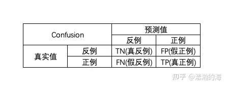
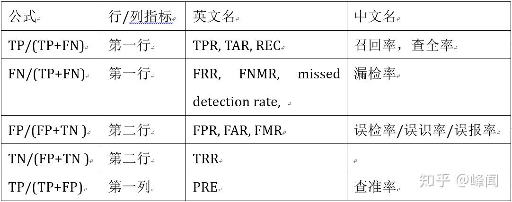
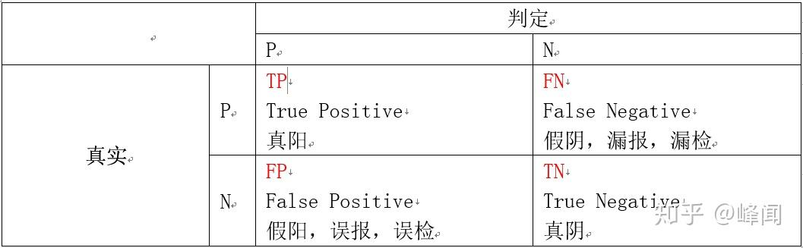

# **机器学习评价指标**

---

# 👉**分类学习器评价指标**

## 二元分类混淆矩阵

## 二元分类评价指标公式

> [!note]这是“二元”分类的计算公式

1.  $TPR=\frac{TP}{TP+FN}$ 越大越好
    - TPR: True Positive Rate
    - RECALL: 召回率
    - pd
    - sensitivity: 敏感度
2.  $FNR=\frac{FN}{TP+FN}$ 越小越好
    - =1-TPR
    - FNR: False Negative Rate
3.  $TNR=\frac{TN}{TN+FP}$ 越大越好
    - TNR: True Negative Rate
    - specificity: 特异度
4.  $FPR=\frac{FP}{TN+FP}$ 越小越好
    - =1-TNR
    - FPR: False Positive Rate
    - pf
5.  $\frac{TP}{TP+FP}$ 越大越好
    - precision: 查准率。
6. $G - mean = \sqrt {TPR \times TNR}=\sqrt {\frac{TP}{TP+FN}\times \frac{TN}{TN+FP}}$
7. $F=\frac{(\alpha^2+1)\times Recall \times Precision}{(\alpha^2)\times Recall+Precision}$ 越大越好
    - $\alpha$ 是参数
8. $F1=\frac{2\times Recall\times Precision}{Recall+Precision}$ 越大越好
    - $\alpha = 1$
    - $F1=\frac{2\times Recall\times Precision}{Recall+Precision}=\frac{TP+TP}{TP+FP+TP+FN}=\frac{2 \times TP}{2 \times TP+FP+FN}$
9.  $ACC=\frac{TP+TN}{TP+FN+FP+TN}$ 越大越好
    - Accuracy
10.  $ERR=\frac{(FP+FN}{TP+FN+FP+TN}$ 越小越好
    - =1-ACC
    - Error rate

11.  $MCC=\frac{TP \times TN-FP \times FN}{\sqrt{(TP+FP)(TP+FN)(TN+FP)(TN+FN)}}$ 越大越好

1.  $Balance=1-\sqrt{\frac{(0-pf)^2+(1-pd)^2}{2}}=1-\sqrt{\frac{FPR^2+FNR^2}{2}}$
    - `balance = 1 - math.sqrt((0 - pf) * (0 - pf) + (1 - pd) * (1 - pd)) / math.sqrt(2)`
2.  $ROC$
    - TPR作为纵坐标，FPR作为横坐标

## 二元分类评价指标图示

---

